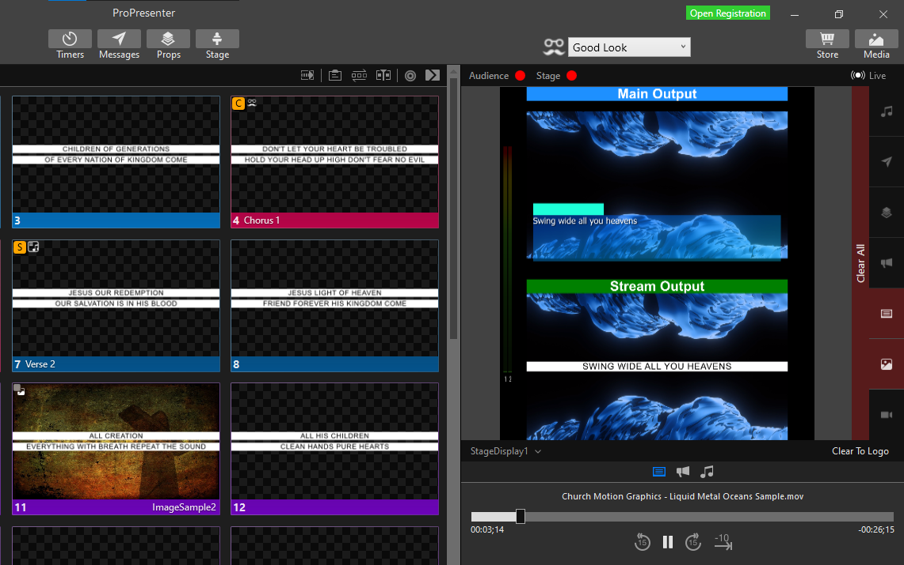

# Pro7LooksHelper-Win10UIA
A tiny Win10 App to quickly Set Looks in Pro7.

It is a separate app that "talks" to Pro7 through Windows UI automation and allows you to set the active look.
Unlike it's [MacOS brother](https://github.com/greyshirtguy/Pro7LooksHelper-AppleScript), it does not auto-update to reflect when active look is changed in Pro7...Unless you have the edit "Looks" window open!

You can open the edit "Looks" window and just minimise it - but, be careful to **restore the looks window manually** by clicking on the Pro7 icon in taskbar and re-selecting it!

To move the window, click and drag on the Looks (Lorax) icon. To close, right-click the app icon in taskbar.

You can download a prebuilt application in [releases](https://github.com/greyshirtguy/Pro7LooksHelper-Win10UIA/releases)

It has been made with same background color as Pro7 toolbar - so you can optionally position the app on top of Pro7 and make it look "at home" on the Pro7 toolbar.

